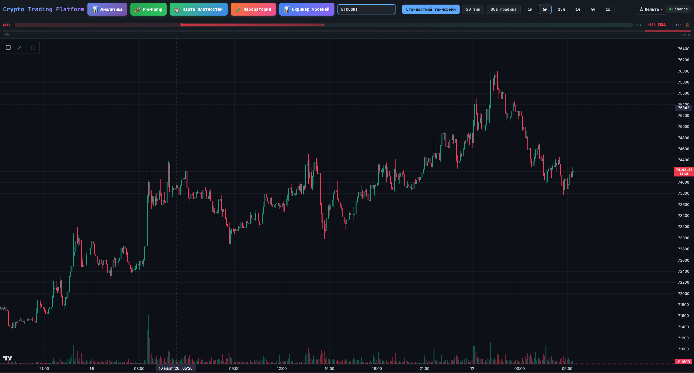
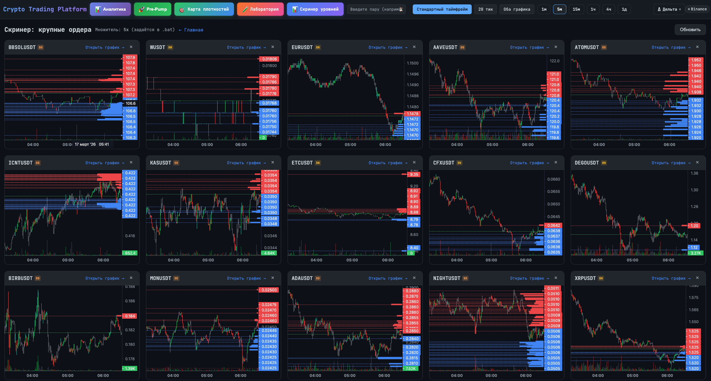
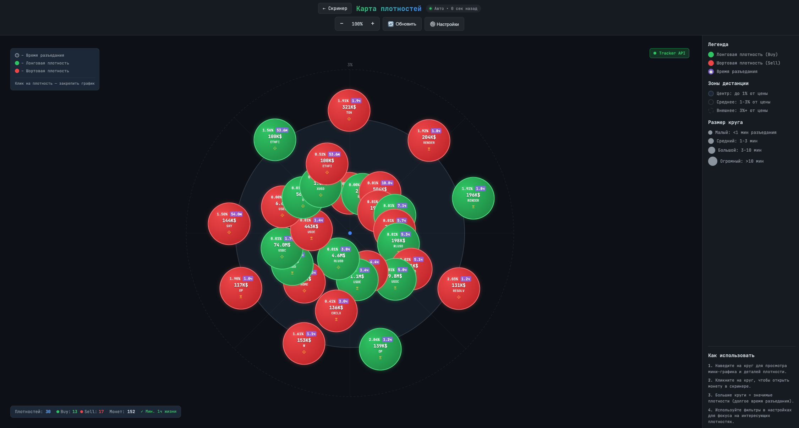
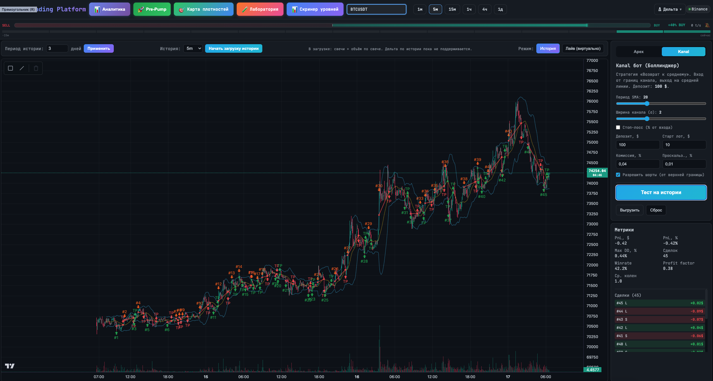
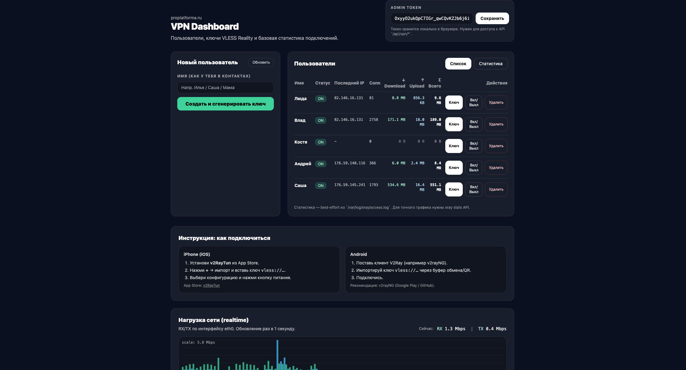
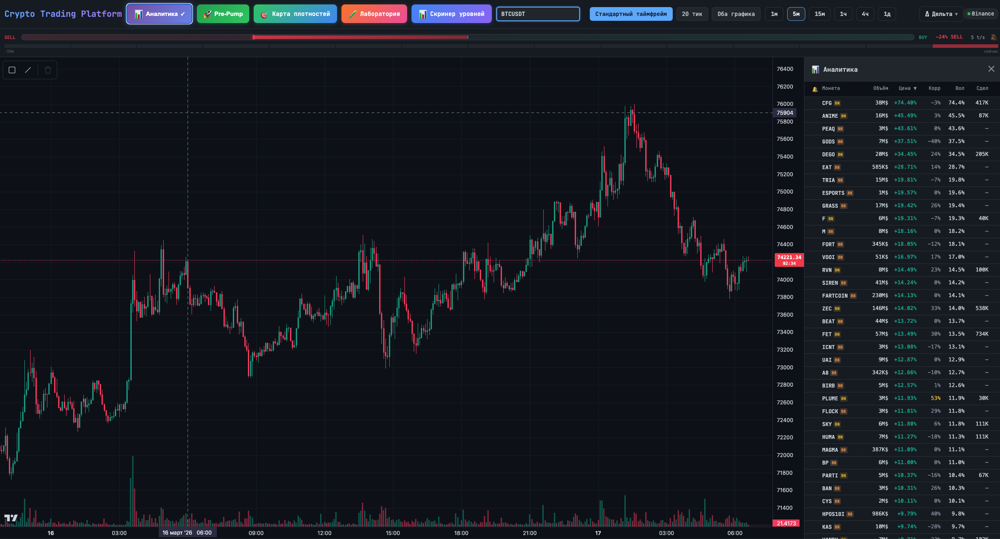

# Crypto Trading Platform

Полнофункциональная торговая платформа для анализа микроструктуры криптовалютных рынков в реальном времени. Подключается к Binance и Bybit через REST + WebSocket API. Построена для поиска торговых паттернов через order flow, tape reading и детекцию аномалий.

**Сайт:** [proplatforma.ru](https://proplatforma.ru)

---

## Скриншоты

<!-- Добавьте скриншоты: перетащите изображения сюда при редактировании на GitHub -->

| Торговый терминал | Скринер крупных ордеров |
|:-:|:-:|
|  |  |

| Карта плотностей | Лаборатория бэктестинга |
|:-:|:-:|
|  |  |

| VPN-панель | Аналитика |
|:-:|:-:|
|  |  |

---

## Функционал

### Торговый терминал
- Свечной график (1м → 1М) с бесконечной прокруткой истории, кумулятивной дельтой и побарной дельтой
- **20-тиковый график** — агрегация из raw trade stream с оверлеем имбаланса стакана, ликвидности и детекцией крупных ордеров
- **Индикатор ускорения ленты** — измеряет скорость давления покупателей/продавцов (не просто объём, а ускорение)
- Ценовые уровни с магнитом к high/low, аудио-алерты через Web Audio API при подходе цены
- Инструменты рисования (горизонтальные линии, лучи) с сохранением по символу
- Двойной режим — стандартный + тиковый график рядом
- Поддержка **Binance** и **Bybit** с автоматическим мержем пар

### Карта плотностей
- Сканирование стенок стакана по 100+ USDT-парам одновременно в реальном времени
- Визуальная scatter-карта с кругами, размер которых = время разъедания стенки средним объёмом
- Фильтрация по дистанции, типу (buy/sell стенки)
- Детекция касаний — отслеживание, когда цена достигает уровня плотности
- SQLite хранилище с автоочисткой устаревших данных

### Система скринеров
- **Скринер крупных ордеров** — сканирует стаканы Binance + Bybit на уровни с объёмом ≥ средний × множитель (по умолчанию 5×). Детекция отскока/пробоя, истечение уровней, cooldown
- **Pre-Pump сканер** — композитный скоринг: соотношение объёмов, позиция цены в 24h диапазоне, процент тейкерских покупок, моментум, декорреляция с BTC
- **Режим мониторинга** — глубокий просмотр одной пары с графиком, статусом уровней и панелью
- Мини-графики с визуализацией уровней в карточках скринера

### Аналитика
- Топ пар по росту, объёму и количеству сделок за 24 часа
- **Корреляция с BTC** — Pearson на часовых свечах для определения, когда альткоин отрывается от Биткоина
- Сортируемые таблицы с переходом на график в один клик

### Лаборатория бэктестинга (Apex Strategy)
- **Z-score детекция аномалий** для входов: Z = (Current_Drop − Mean_R) / (StdDev_R × √(L/R))
- Настраиваемые параметры: Scanner Sigma (S), Drop Length (L), Retrospective (R)
- **Grid/Martingale** управление позицией с динамическим пересчётом средней цены
- **Take-profit offset**: P_take = P_avg + (P_drop_avg − P_avg) × alpha
- OBI-фильтр (Order Book Imbalance) для качества входов
- Трендовый фильтр (EMA), ATR-режимный фильтр, cooldown, caps экспозиции
- **Оптимизация параметров** — grid search по Sigma, Alpha, Length, Grid Legs, Grid Step с отслеживанием прогресса
- Кривая эквити + просадка с полными метриками: Net PnL, Max DD, Recovery Factor, Profit Factor, Win Rate
- Скачивание истории с Binance (gzip-сжатие)
- Поддержка Long + Short сигналов

### ML-пайплайн (XGBoost)
- **Экспорт** истории в CSV
- **Feature engineering** — returns (1/5/10 бар), volume MA ratio, volume Z-score, EMA кроссоверы (20/50), ATR-нормализованный range
- **Train/Val/Test split** с настраиваемыми пропорциями
- **XGBoost классификатор** (3 класса: down/flat/up) для фильтрации направления входа
- Сохранение модели и статус по символу/таймфрейму
- Интеграция в бэктестер как опциональный ML-фильтр

### VPN-система
- Протокол **Xray VLESS Reality** — современный VPN, устойчивый к блокировкам
- Веб-дашборд (`/vpn/`) для управления пользователями: создание, включение/отключение, удаление
- Автогенерация VLESS URI для подключения
- Статистика трафика по пользователям через Xray gRPC Stats API
- Отслеживание подключений (последний визит, IP, количество соединений)
- Мониторинг пропускной способности сети (RX/TX Mbps)
- **Shadowsocks** как запасной вариант
- Эндпоинт подписок (`/sub/`) для автоконфигурации клиентов

### Прокси Binance API
- Серверный прокси через **Cloudflare WARP** VPN-туннель
- Обход гео-блокировок (418 бан) и CORS-проблем для браузерных клиентов
- Белый список эндпоинтов: ticker, exchangeInfo, klines, depth, ping
- Прозрачно для фронтенда — тот же интерфейс API

### Уведомления и алерты
- **Web Audio API** — синтезированные звуки для ценовых уровней, имбаланс ≥70%, pre-pump сигналов
- **Telegram Bot** — push-уведомления для событий плотности
- **Скринер-уведомления** — toast-алерты при обнаружении новых монет с крупными ордерами
- Фоновый WebSocket-мониторинг всех сохранённых уровней по всем парам

---

## Архитектура

```
┌──────────────────────────────────────────────────────────┐
│                   Next.js 14 Frontend                    │
│        React 18 · TypeScript · Zustand · LWC             │
├──────────┬──────────────┬────────────────────────────────┤
│  Binance │    Bybit     │        Python Backend          │
│ REST+WS  │   REST+WS    │     FastAPI :8765              │
└──────────┴──────────────┴────────────────────────────────┘
                               │
          ┌────────────────────┼────────────────────┐
          │                    │                    │
     Density Tracker      Скринеры             Lab Engine
     (100+ пар WS)     (Big Orders +         (Бэктестер +
          │              Pre-Pump)            ML Pipeline)
          │                                       │
       SQLite                                  XGBoost
     densities.db                           обученные модели
          │
     Telegram Bot ──── push-уведомления
          │
     VPN Manager ──── Xray VLESS Reality
                      Shadowsocks
                      WARP Proxy
```

---

## Стек технологий

| Слой | Технологии |
|------|-----------|
| Фронтенд | Next.js 14, React 18, TypeScript, Zustand, Lightweight Charts (TradingView), Axios |
| Бэкенд | Python 3, FastAPI, aiohttp, uvicorn, SQLite |
| ML | XGBoost, scikit-learn, NumPy, pandas |
| API бирж | Binance REST v3 + WebSocket, Bybit REST v5 + WebSocket |
| VPN | Xray (VLESS Reality), Shadowsocks, Cloudflare WARP |
| AI/OCR | Google Gemini API |
| Алерты | Web Audio API, Telegram Bot API |
| Деплой | Nginx, PM2, Ubuntu VDS |

---

## API — 34 эндпоинта

<details>
<summary>Развернуть полный список API</summary>

| Группа | Эндпоинт | Метод | Описание |
|--------|----------|-------|----------|
| **Core** | `/api/densities` | GET | Активные плотности стакана с фильтрами |
| | `/api/densities/{id}` | GET | Детали плотности + история касаний |
| | `/api/stats` | GET | Статистика трекера |
| | `/api/coins` | GET | Отслеживаемые монеты |
| | `/api/cleanup` | POST | Очистка старых записей |
| **Proxy** | `/api/binance-proxy/{path}` | GET | Прокси Binance через WARP VPN |
| **Скринер** | `/api/screener/big-orders` | GET | Крупные ордера по биржам |
| | `/api/screener/pre-pump` | GET | Pre-pump сигналы |
| **Lab** | `/api/lab/history-status` | GET | Статус локальной истории |
| | `/api/lab/download-history` | POST | Запуск загрузки истории |
| | `/api/lab/download-status` | GET | Прогресс загрузки |
| | `/api/lab/history-candles` | GET | Свечи из истории |
| | `/api/lab/optimize` | POST | Запуск оптимизации параметров |
| | `/api/lab/optimize-progress` | GET | Прогресс оптимизации |
| | `/api/lab/equity-curve` | POST | Расчёт кривой эквити |
| **ML** | `/api/lab/ml-export` | POST | Экспорт истории в CSV |
| | `/api/lab/ml-prepare` | POST | Feature engineering + split |
| | `/api/lab/ml-train` | POST | Обучение XGBoost модели |
| | `/api/lab/ml-model-status` | GET | Статус обученной модели |
| **VPN** | `/api/vpn/users` | GET | Список VPN-пользователей |
| | `/api/vpn/users` | POST | Создание пользователя |
| | `/api/vpn/users/{id}/toggle` | POST | Вкл/выкл пользователя |
| | `/api/vpn/users/{id}` | DELETE | Удаление пользователя |
| | `/api/vpn/stats` | GET | Трафик + статистика подключений |
| | `/api/vpn/net` | GET | Пропускная способность сети |
| **Telegram** | `/api/telegram/settings` | GET/POST | Настройки уведомлений |
| | `/api/telegram/test` | POST | Тестовое сообщение |
| **X5** | `/api/x5/analyze` | POST | OCR таблицы через Gemini |

</details>

---

## Страницы

| Маршрут | Описание |
|---------|----------|
| `/` | Торговый терминал — графики, лента, дельта, уровни, алерты |
| `/analytics` | Аналитика — топ роста, корреляция с BTC |
| `/screener` | Скринер крупных ордеров с мини-графиками |
| `/screener/monitor` | Мониторинг уровней по одной паре |
| `/pre-pump` | Pre-pump сканер |
| `/density-map` | Визуальная карта плотностей стакана |
| `/dom-surface` | Лаборатория — Apex стратегия, оптимизация, ML |
| `/dom-surface/equity` | Отчёт по кривой эквити с детализацией сделок |
| `/vpn/` | Управление VPN-пользователями |
| `/x5/` | Сканер производства |

---

## Ключевые технические решения

- **20-тиковые свечи** строятся на клиенте из raw WebSocket trade stream — нулевая зависимость от сервера
- **Имбаланс стакана** считается потиково, а не побарно — более высокая гранулярность
- **Трекер плотностей** работает как персистентный async-процесс, сканируя 100+ пар через WebSocket
- **Бэктестер использует идентичную логику с live-исполнением** — единый источник истины в `lab_history.py`
- **Прокси Binance API** проходит через Cloudflare WARP для обхода гео-ограничений без VPN на клиенте
- **High-precision decimals** для всех расчётов цен/размеров — предотвращение ошибок округления
- WebSocket-соединения с **exponential backoff reconnect** (до 5 попыток)
- REST API с **таймаутами 15с** и **retry с backoff**

---
---

# Crypto Trading Platform — English

Full-stack real-time cryptocurrency trading platform for market microstructure analysis. Connects to Binance and Bybit via REST + WebSocket APIs. Built for finding actionable trading patterns through order flow, tape reading, and anomaly detection.

**Live:** [proplatforma.ru](https://proplatforma.ru)

---

## Screenshots

<!-- Add screenshots: drag and drop images here when editing on GitHub -->

| Trading Terminal | Big Orders Screener |
|:-:|:-:|
|  |  |

| Density Map | Backtesting Lab |
|:-:|:-:|
|  |  |

| VPN Dashboard | Analytics |
|:-:|:-:|
|  |  |

---

## Features

### Trading Terminal
- Candlestick charts (1m → 1M) with infinite scroll history, cumulative delta, and per-bar delta visualization
- **20-tick chart** — aggregated from raw trade stream with order book imbalance overlay, liquidity imbalance, and big order detection
- **Tape acceleration indicator** — measures buy/sell pressure velocity across 15-minute blocks (not just volume, but rate of change)
- Price levels with snap-to-high/low, real-time audio alerts (Web Audio API) when price approaches within configurable distance
- Drawing tools (horizontal lines, rays) persisted per symbol
- Dual chart mode — standard + tick chart side by side
- Supports both **Binance** and **Bybit** exchanges with automatic pair merging

### Density Map
- Real-time scanning of order book walls across 100+ USDT pairs simultaneously
- Visual scatter map with circles sized by wall erosion time
- Distance zone filtering, type filtering (buy/sell walls)
- Touch detection — tracks when price reaches a density level
- SQLite persistence with automatic cleanup of stale data

### Screener System
- **Big Orders Screener** — scans Binance + Bybit order books for levels where size ≥ average × multiplier (configurable, default 5×). Bounce/break detection, level expiry, cooldown logic
- **Pre-Pump Scanner** — composite scoring: volume ratio, price position relative to 24h range, taker buy percentage, price change momentum, and BTC correlation breakdown
- **Monitor mode** — single-pair deep view with chart, real-time level status, and level panel
- Mini-charts with level visualization in screener cards

### Analytics Dashboard
- Top pairs by 24h growth, volume, and trade count
- **BTC correlation analysis** — Pearson correlation on 1h candles to identify when an altcoin decouples from Bitcoin
- Sortable tables with one-click navigation to trading terminal

### Backtesting Lab (Apex Strategy)
- **Z-score anomaly detection** for entries: Z = (Current_Drop − Mean_R) / (StdDev_R × √(L/R))
- Configurable parameters: Scanner Sigma (S), Drop Length (L), Retrospective (R)
- **Grid/Martingale** position management with dynamic average price recalculation
- **Take-profit offset**: P_take = P_avg + (P_drop_avg − P_avg) × alpha
- OBI (Order Book Imbalance) filter for entry quality
- Trend filter (EMA), ATR regime filter, cooldown bars, exposure caps
- **Parameter optimization** — brute-force grid search over Sigma, Alpha, Length, Grid Legs, Grid Step ranges with real-time progress tracking
- Equity curve + drawdown chart with full metrics: Net PnL, Max Drawdown, Recovery Factor, Profit Factor, Win Rate
- History download from Binance (gzip-compressed local storage)
- Long + Short signal support

### ML Pipeline (XGBoost)
- **Export** — history candles to CSV with OHLCV data
- **Feature engineering** — returns (1/5/10 bar), volume MA ratio, volume Z-score, EMA crossovers (20/50), ATR-normalized range, high-low range
- **Train/Val/Test split** with configurable ratios
- **XGBoost classifier** (3 classes: down/flat/up) for entry direction filtering
- Model persistence and status tracking per symbol/timeframe
- Integrated into backtester as optional ML filter for entries

### VPN Management System
- **Xray VLESS Reality** protocol — modern censorship-resistant VPN
- Web dashboard (`/vpn/`) for user management: create, toggle, delete users
- Auto-generation of VLESS connection URIs with QR-compatible links
- Per-user traffic statistics via Xray gRPC Stats API
- Connection tracking (last seen, last IP, connection count) from access logs
- Real-time network throughput monitoring (RX/TX Mbps) via `/proc/net/dev`
- **Shadowsocks** fallback configuration
- Subscription endpoint (`/sub/`) for client auto-configuration

### Binance API Proxy
- Server-side proxy for Binance REST API through **Cloudflare WARP** VPN tunnel
- Bypasses geo-restrictions (418 bans) and CORS issues for browser clients
- Whitelisted endpoints: ticker, exchangeInfo, klines, depth, ping
- Transparent to frontend — same API interface, routed through server

### Notifications & Alerts
- **Web Audio API** — synthesized alert sounds for price levels, imbalance spikes (≥70%), pre-pump signals
- **Telegram Bot** — push notifications for density events with configurable distance threshold and cooldown
- **Screener notifications** — toast alerts when new coins with large order levels are detected
- Background WebSocket monitoring across all saved levels on all pairs

---

## Architecture

```
┌──────────────────────────────────────────────────────────┐
│                   Next.js 14 Frontend                    │
│        React 18 · TypeScript · Zustand · LWC             │
├──────────┬──────────────┬────────────────────────────────┤
│  Binance │    Bybit     │        Python Backend          │
│ REST+WS  │   REST+WS    │     FastAPI on port 8765       │
└──────────┴──────────────┴────────────────────────────────┘
                               │
          ┌────────────────────┼────────────────────┐
          │                    │                    │
     Density Tracker      Screeners             Lab Engine
     (100+ pairs WS)    (Big Orders +         (Backtester +
          │              Pre-Pump)            ML Pipeline)
          │                                       │
       SQLite                                  XGBoost
     densities.db                           trained models
          │
     Telegram Bot ──── push notifications
          │
     VPN Manager ──── Xray VLESS Reality
                      Shadowsocks
                      WARP Proxy
```

---

## Tech Stack

| Layer | Technologies |
|-------|-------------|
| Frontend | Next.js 14, React 18, TypeScript, Zustand, Lightweight Charts (TradingView), Axios |
| Backend | Python 3, FastAPI, aiohttp, uvicorn, SQLite |
| ML | XGBoost, scikit-learn, NumPy, pandas |
| Exchange APIs | Binance REST v3 + WebSocket, Bybit REST v5 + WebSocket |
| VPN | Xray (VLESS Reality), Shadowsocks, Cloudflare WARP |
| AI/OCR | Google Gemini API (multi-model) |
| Alerts | Web Audio API, Telegram Bot API |
| Deploy | Nginx, PM2, Ubuntu VDS, SCP-based deployment |

---

## API Endpoints — 34 total

<details>
<summary>Click to expand full API reference</summary>

| Group | Endpoint | Method | Description |
|-------|----------|--------|-------------|
| **Core** | `/api/densities` | GET | Active order book densities with filters |
| | `/api/densities/{id}` | GET | Density details + price touch history |
| | `/api/stats` | GET | Tracker statistics |
| | `/api/coins` | GET | Currently tracked coins |
| | `/api/cleanup` | POST | Cleanup old density records |
| **Proxy** | `/api/binance-proxy/{path}` | GET | Binance API proxy via WARP VPN |
| **Screener** | `/api/screener/big-orders` | GET | Big order levels across exchanges |
| | `/api/screener/pre-pump` | GET | Pre-pump composite signals |
| **Lab** | `/api/lab/history-status` | GET | Check local history availability |
| | `/api/lab/download-history` | POST | Start background history download |
| | `/api/lab/download-status` | GET | Download progress |
| | `/api/lab/history-candles` | GET | Candles from local history |
| | `/api/lab/optimize` | POST | Run parameter optimization |
| | `/api/lab/optimize-progress` | GET | Optimization progress |
| | `/api/lab/equity-curve` | POST | Calculate equity + drawdown curves |
| **ML** | `/api/lab/ml-export` | POST | Export history to CSV |
| | `/api/lab/ml-prepare` | POST | Feature engineering + train/test split |
| | `/api/lab/ml-train` | POST | Train XGBoost model |
| | `/api/lab/ml-model-status` | GET | Check trained model availability |
| **VPN** | `/api/vpn/users` | GET | List VPN users with VLESS URIs |
| | `/api/vpn/users` | POST | Create new VPN user |
| | `/api/vpn/users/{id}/toggle` | POST | Enable/disable user |
| | `/api/vpn/users/{id}` | DELETE | Remove user |
| | `/api/vpn/stats` | GET | Per-user traffic + connection stats |
| | `/api/vpn/net` | GET | Network interface throughput |
| **Telegram** | `/api/telegram/settings` | GET/POST | Notification settings |
| | `/api/telegram/test` | POST | Send test message |
| **X5** | `/api/x5/analyze` | POST | OCR bakery table via Gemini |

</details>

---

## Pages

| Route | Description |
|-------|-------------|
| `/` | Trading terminal — charts, tape speed, delta, price levels, alerts |
| `/analytics` | Market analytics — top movers, BTC correlation |
| `/screener` | Big orders screener with mini-charts |
| `/screener/monitor` | Single-pair level monitoring |
| `/pre-pump` | Pre-pump signal scanner |
| `/density-map` | Visual order book density map |
| `/dom-surface` | Backtesting lab — Apex strategy, optimization, ML pipeline |
| `/dom-surface/equity` | Equity curve report with trade-level breakdown |
| `/vpn/` | VPN user management dashboard |
| `/x5/` | Bakery production scanner |

---

## Key Technical Decisions

- **20-tick candles** are built client-side from raw WebSocket trade stream — zero server dependency for real-time chart data
- **Order book imbalance** is calculated per-tick for higher granularity than per-candle analysis
- **Density tracker** runs as a persistent async process, scanning 100+ pairs simultaneously via WebSocket
- **Backtester uses identical logic to live execution** — single source of truth in `lab_history.py`
- **Binance API proxy** routes through Cloudflare WARP to bypass geo-restrictions without requiring client-side VPN
- **High-precision decimals** for all price/size calculations to prevent floating-point rounding errors in financial math
- All WebSocket connections implement **exponential backoff reconnection** (up to 5 retries)
- REST API calls include **15s timeouts** and **retry with backoff** for resilience

---

## Local Development

```bash
# Frontend
npm install
npm run dev              # http://localhost:3000

# Backend
cd python
pip install -r requirements.txt
python api_server.py     # http://localhost:8765
```

---

## Project Structure

```
app/                      # Next.js App Router pages
src/
  components/             # React components (30+)
    density-map/          #   density map visualization
    dom-surface/          #   backtester / lab UI
    pre-pump/             #   pre-pump scanner
    screener/             #   big orders screener
  lib/                    # API clients and utilities
    binance.ts            #   Binance REST + WebSocket + proxy
    bybit.ts              #   Bybit REST + WebSocket
    densityApi.ts         #   density tracker client
    labApi.ts             #   backtester API client
    screenerApi.ts        #   screener API client
    correlation.ts        #   BTC correlation analysis
  store/                  # Zustand state stores (7 stores)
  types/                  # TypeScript definitions
public/
  vpn/                    # VPN management dashboard
  x5/                     # Bakery scanner UI
  sub/                    # VPN subscription endpoints
python/
  api_server.py           # FastAPI backend (34 endpoints)
  tracker.py              # Real-time density tracker (100+ pairs)
  lab_history.py          # Backtester + optimizer engine
  big_orders_screener.py  # Big orders detection
  pre_pump_screener.py    # Pre-pump signal scoring
  telegram_notifier.py    # Telegram push notifications
  ml_*.py                 # ML pipeline (export → features → train)
  config.py               # Centralized configuration
  database.py             # SQLite ORM for densities
deploy/
  nginx-proplatforma.conf # Nginx configuration
```

---

## License

This project is for portfolio/demonstration purposes.
